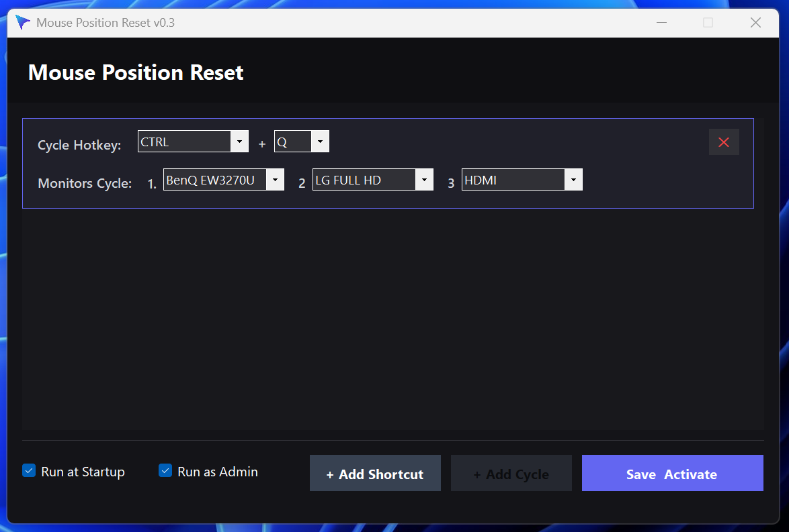

# Mouse Position Reset v0.4

An elegant, modern Windows utility built with .NET 10 and Windows Forms that allows you to register global hotkeys to immediately reset or transition your mouse cursor to specific coordinates or center positions across multiple monitors. 

Additionally, it supports cycling your cursor sequentially through your monitors with a single customizable cycle hotkey.


---

## Features

- **Global Shortcuts**: Move your mouse cursor instantly to the center or a custom coordinate on any monitor.
- **Cycle Position Sequence**: Configure a single hotkey to cycle the cursor across your screens. 
  - Displays individual pull-down menus for each monitor slot.
  - Customize the cycling order (e.g., `Monitor 2 → Monitor 3 → Monitor 1`).
  - Add `[Disabled]` on any slot in the sequence to skip it during the cycle.
- **Auto Resize Active Window**: Global hotkey (e.g., `CTRL + R`) to instantly restore (if minimized) and resize the foreground window to 80% of the active monitor's working area and center it.
- **Visual Declaring**: Use the built-in 3-second countdown reticle tool to grab exact pixel coordinates on any monitor.
- **Run at Startup & Admin Mode**: Integrates directly with the Windows Registry to automatically start the utility minimized in the system tray, with optional administrator elevation support.
- **Tray Optimization**: Automatically minimizes to the Windows System Tray to stay out of your workspace while listening for your hotkeys.
- **DPI-Aware**: High-DPI layout rendering ensures text, fields, and buttons stay crisp on 4K or mixed-DPI displays.

---

## Getting Started

### Prerequisites

- **Windows 10 / 11**
- **.NET 10 Runtime**

### Running the Application

1. Build the application or download the latest release.
2. Launch `MousePositionReset.exe`.
3. It will load settings from `MousePositionReset.json` (located in the same directory as the executable) if it exists, or start with defaults.
4. Click **+ Add Shortcut** to bind a hotkey to a specific monitor position, or click **+ Add Cycle** to set up a cycle hotkey.
5. Configure the **Auto Resize Window** hotkey (e.g., `CTRL + R`) in the top panel to quickly resize active windows on demand.
6. Click **Save & Activate**. The app will minimize to your system tray. Double-click the tray icon at any time to reopen the configuration interface.

### Settings & Configuration Demo



---

## Configuration Settings (`MousePositionReset.json`)

The application automatically saves configuration settings to a JSON file alongside the executable:

```json
{
  "RunAtStartup": true,
  "RunAsAdministrator": false,
  "ResizeWindowHotkey": {
    "Modifier": "CTRL",
    "Key": "R"
  },
  "Shortcuts": [
    {
      "Modifier": "CTRL",
      "Key": "A",
      "MonitorName": "Dell U2415 (Primary) - 1920x1200",
      "MonitorExactName": "Dell U2415 (Primary) - 1920x1200",
      "MonitorWidth": 1920,
      "MonitorHeight": 1200,
      "IsCenter": true,
      "X": 0,
      "Y": 0,
      "IsCycle": false
    }
  ],
  "Cycle": [
    {
      "Modifier": "CTRL",
      "Key": "C",
      "MonitorSequence": [
        {
          "MonitorName": "Dell U2415 (Primary) - 1920x1200",
          "MonitorDeviceName": "\\\\.\\DISPLAY1"
        },
        {
          "MonitorName": "[Disabled]",
          "MonitorDeviceName": ""
        },
        {
          "MonitorName": "ASUS PB278 - 2560x1440",
          "MonitorDeviceName": "\\\\.\\DISPLAY3"
        }
      ]
    }
  ]
}
```

---

## Building from Source

To compile the application manually:

```powershell
# Clone the repository
git clone https://github.com/yourusername/MousePositionReset.git
cd MousePositionReset

# Build debug configuration
dotnet build

# Build release configuration
dotnet build -c Release
```

---

## License

This project is licensed under the MIT License.
